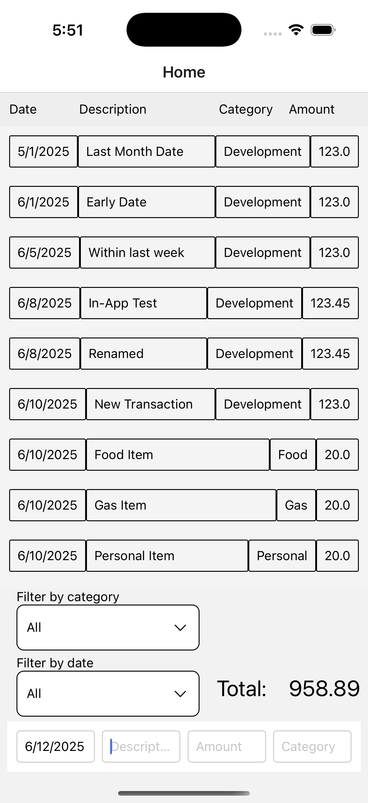
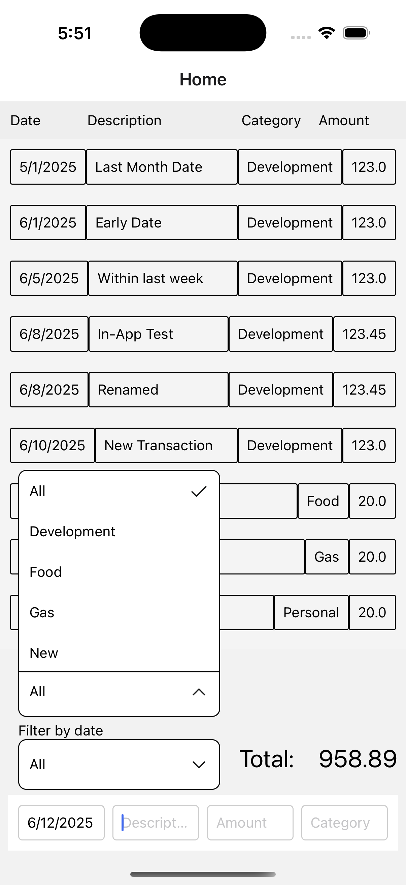
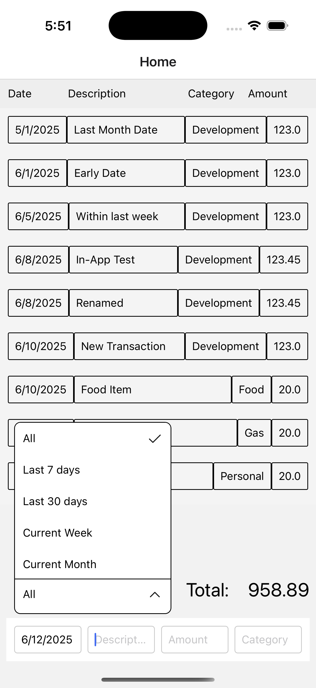
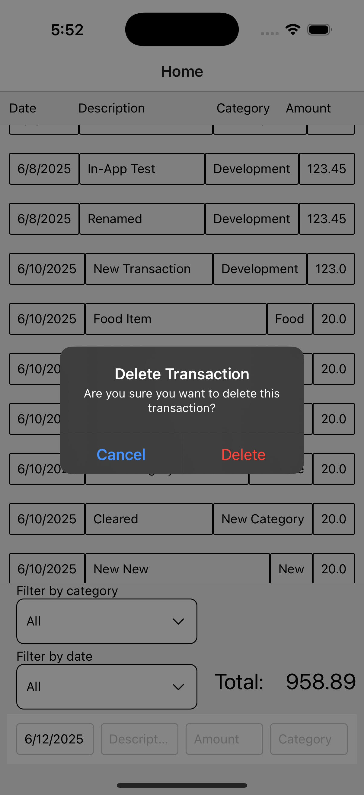
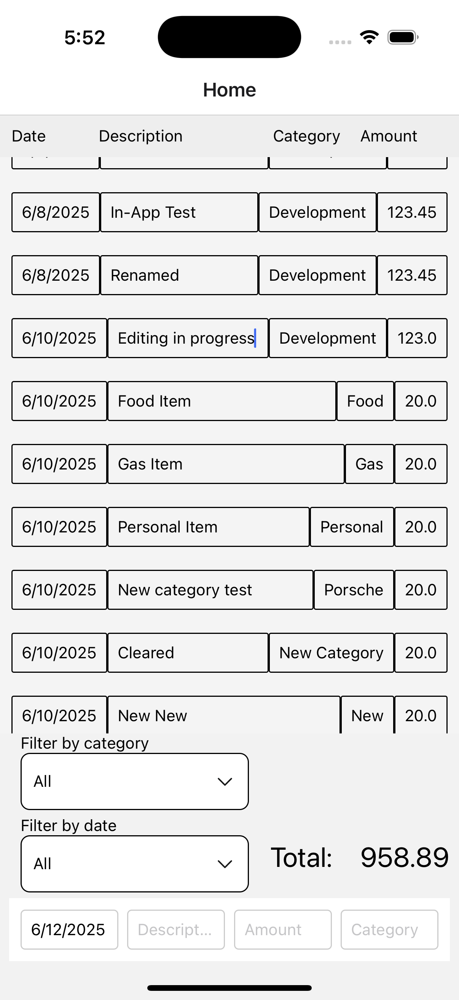

# Budgetr readme

## Design and Purpose
I have long used buget apps to track my spending. I like to manually enter each transaction, as it keeps me in-sync with my spending and makes it easy to reconcile deviations. Most modern apps that I hvae tried center around downloading transactions from a bank server and importing them, and leave the manual transaction entry method as an afterthought. I used to use YNAB 4, but they have moved on to a new web-based application that is very rigid and does not support the interaction flows I was used to.

Creating a custom application to handle this task has been on my mind for many years. This course provided the opportunity to execute on my vision.

Screenshots of the app follow at the end of this file.

## Server API
I used PHP to define an API between my React Native client and my SQLite database. The API defines four endpoints:
- addTransaction.php
- deleteTransaction.php
- getTransactions.php
- updateTransaction.php

A transaction object is defined as having four user-defined fields (date, description, amount, and category) as well as an automatically-generated unique ID. AddTransaction and UpdateTransaction both require all five fields to be supplied by the client. DeleteTransaction simply requires the UUID of the target transaction. GetTransactions has no parameters and returns the entire contents of the transactions table.

I used the curl command to test my API. An example test command is as follows:

    curl -X POST https://www.cs.drexel.edu/~rb468/api/addTransaction.php \
    -H "Content-Type: application/json" \
    -H "User-Agent: Mozilla/5.0 (Macintosh; Intel Mac OS X 10_15_7) AppleWebKit/537.36 (KHTML, like Gecko) Chrome/114.0.0.0 Safari/537.36" \
    -d '{
        "id": "123e4567-e89b-12d3-a456-426614174000",
        "date": "06/10/2025",
        "description": "Test add from curl",
        "amount": 23.45,
        "category": "Test Category"
    }'

The UserAgent string needed to be spoofed due to restrictions on the Drexel tux server which reject the curl user agent.

The equivilent method in my app code is:

    export async function postTransaction(transaction) {
        const response = await fetch(`${API_URL}/addTransaction.php`, {
        method: 'POST',
        headers: { 'Content-Type': 'application/json' },
        body: JSON.stringify(transaction),
        });
        const result = await response.json();

        if (result.status !== 'success') 
        {
            throw new Error(result.message || 'Server error');
        }

    return response;
    }

The transaction objet being supplied is defined as:

    {
        "id": "123e4567-e89b-12d3-a456-426614174000",
        "date": "06/10/2025",
        "description": "Test add from curl",
        "amount": 23.45,
        "category": "Test Category"
    }

## Experiences
I encountered some issues setting up and configuring the database and APIs. I had never created a database or server APIs before. I had issues with permissions and with the MongoDB configuration (which is why I decided to use SQLite). Ultimately I hosted my database and API on tux.

I had grand designs for the UI for this app, most of which did not come to fruition. One feature I developed but abandoned was auto-formatting date text as the user typed. It would expand '6/' to '06/' when representing a day or month, it would auto-insert '/' after a two-diget day or month, it would prevent the user from adding a second '/' after the auto-inserted slash, and it would automatically insert the current year if the user tabbed out of the field without specifying a year. I chose to abandon this as it was taking too much time for such a small feature.

Other UI components I did not get to include resizeable columns, click-to-sort column headers, custom date ranges, and expanded analytics such as per-category totals, month-to-month spending, budget targets, etc. I also did not meet me goal of providing an expanded UI when running the app in a desktop web browser.

A feature I am proud of that I managed to include is the inline editing of transactions. I developed a click-to-edit component in my Assignment 3 and repurposed it here as EditableTextField.

## Screenshots
The screenshots below depict, in order:

Home Screen
Category filter expanded
Date filter expanded
Delete transaction prompt
User editing transaction

