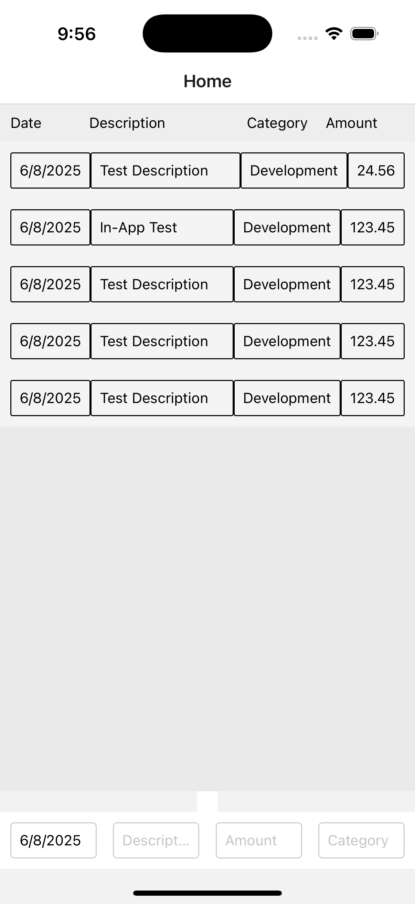
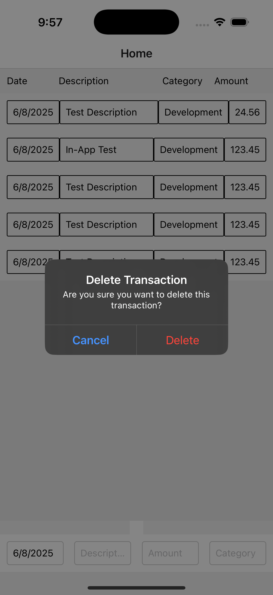
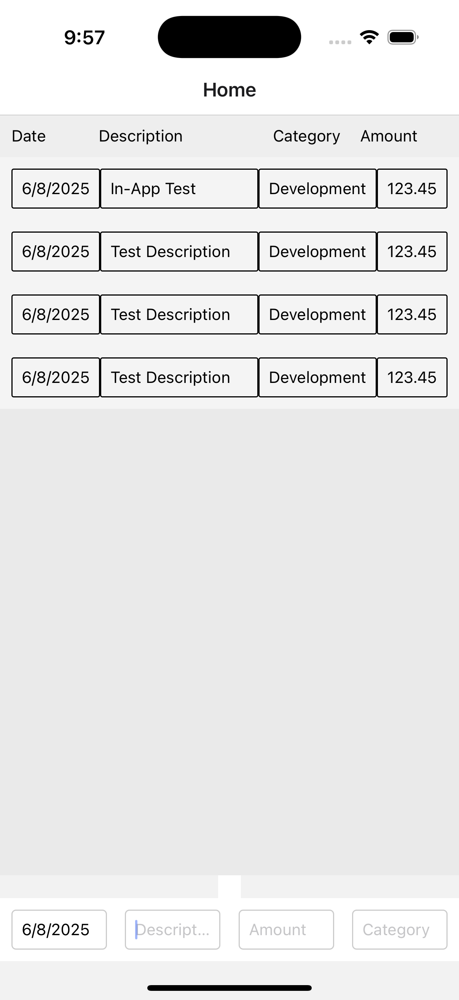

#Budgetr app readme

In principle budgetr is a budget management app. In practice, this version servers
as a tech demo. This app includes the ability to add and delete transactions.
Transactions are stored remotely in an sqlite database.

To enter a new transaction into the database:
Enter approriate values into the four text boxes at the bottom of the screen.
All four boxes must be completed to submit the new transaction.
When all four boxes are filled, press 'return' to add the transaction to the database.

To delete a transaction:
Click on the transaction row you wish to delete.
A confirmation dialog appears.
Click 'Delete' to delete the transaction, or 'Cancel' to abort.

The following images show the flow of entering and then deleting a transaction.

