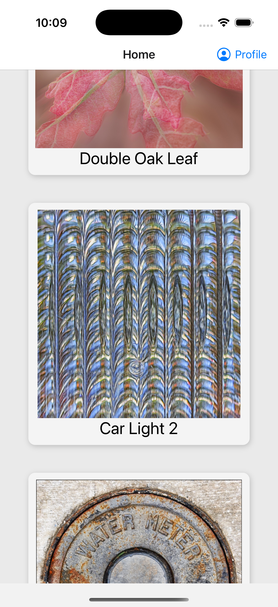
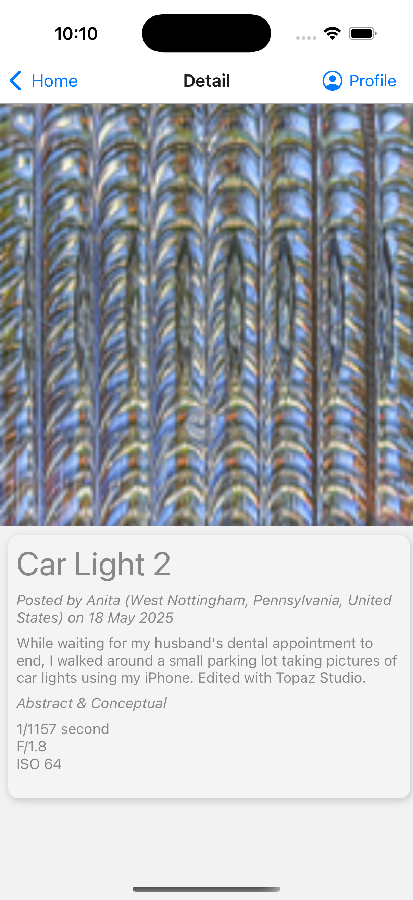
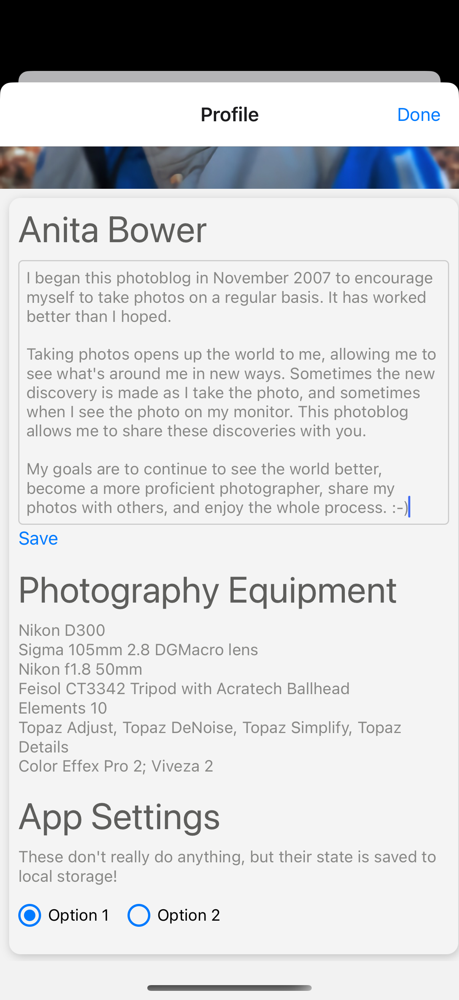

#"Gallery" app readme

This app is built as a gallery of images featured on my mothers photo blog ([anitabower.aminus3.org](https://anitabower.aminus3.com)).
The home screen features a scrollable list of images. Tapping on an image displays the image detail screen, featuring a large version of the image, and details such as where it was taken and informaiton about the camera.

A profile button is visible in the top right corner on all screens. Tapping this brings up the profile of the artist. The biography is editable, using the blue edit button. When finished edditing, tap the blue save button. The edited data is now saved to local storage.

Additionally on the profile page are two radio buttons. They serve no purpose, but their state is saved to local storage.

