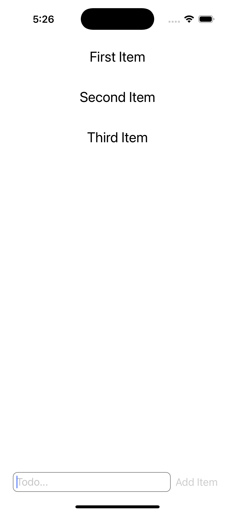

# Ross Bower's TODO List README

Welcome! My TODO list is awsome and has many great features, including:

* Adding items
* Completing items
* Deleting items

By default the app launches with three example items.

## To add an item

Type the text for the item into the "Todo..." box at the bottom of the screen, then tap "Add item".

## To complete an item

Simply tap an item in the list to mark it as completed.

## To delete an item

To delete an item from the list (completed or uncompleted) long-press the item. A confirmation dialog will appear. Tap "Delete" to delete the item.
